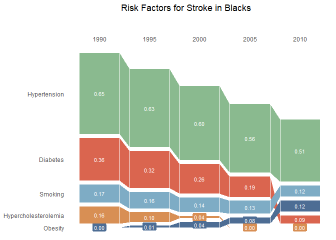

<!-- README.md is generated from README.Rmd. Please edit that file -->

# sankey

<!-- badges: start -->
<!-- badges: end -->

The goal of `sankey` is to …

## Installation

You can install the development version of `sankey` from
[GitHub](https://github.com/) with:

``` r
# install.packages("devtools")
devtools::install_github("gracemhw/sankey")
```

## Example

This is a basic example:

``` r
library(sankey)
## basic example code
# Example data
strokedata <- read.csv(
  system.file("extdata", "strokedata.csv", package = "sankey")
)

# Scenario 1: With both horizontal and vertical white space
plot_sankey(strokedata,
            title = "Risk Factors for Stroke in Blacks",
            timeslope = 1, hspace = 0.03, vspace = TRUE)
```


